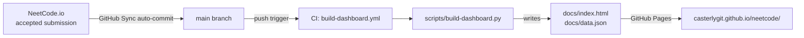

# neetcode

[](LICENSE)
[](https://www.python.org/)
[](https://github.com/CasterlyGit/neetcode/actions/workflows/build-dashboard.yml)

**Auto-synced NeetCode.io practice log — 39 problems solved (27 Easy, 12 Medium), 84 submissions, all in Python, with a live GitHub Pages dashboard that rebuilds on every push.**

**Status:** v0.1.0 — active DSA practice; syncing continuously from NeetCode.io since April 2026.

**Live dashboard:** https://casterlygit.github.io/neetcode/

The dashboard shows total problems solved, language breakdown, difficulty mix, recent solves with expandable syntax-highlighted code, and a GitHub-style activity heatmap.

---

## What this is

This repo is an auto-synced practice log. Every time a solution is accepted on [NeetCode.io](https://neetcode.io), the GitHub Sync feature commits it here directly. No manual copy-paste. The CI workflow then regenerates `docs/index.html` and `docs/data.json` so the dashboard stays current.

This is not a curated solutions library — it is a live record of active practice, including multiple submission attempts per problem (the `submission-N.py` files show iteration over time).

---

## Signal

| Metric | Value |
|---|---|
| Problems solved | 39 |
| Total submissions | 84 |
| Easy / Medium / Hard | 27 / 12 / 0 |
| Languages | Python |
| Active days | 5 (April–May 2026) |
| Dashboard auto-rebuild | CI on every push to `main` |

---

## Pipeline

```
neetcode.io  →  GitHub Sync (auto-commits on each accepted submission)
             →  push to main
             →  .github/workflows/build-dashboard.yml runs
             →  scripts/build-dashboard.py regenerates docs/index.html + docs/data.json
             →  GitHub Pages serves the dashboard at casterlygit.github.io/neetcode/
```



---

## Layout

```
Data Structures & Algorithms/<problem-slug>/submission-N.py
                                  the solutions themselves (multiple = iteration)
docs/index.html                   the dashboard (data inlined for offline support)
docs/data.json                    same data, standalone JSON
docs/_template.html               HTML template that build-dashboard.py fills
scripts/build-dashboard.py        regenerate dashboard from current state
.github/workflows/build-dashboard.yml
                                  CI: rebuild on every submission push
```

---

## Setup

No dependencies beyond Python 3.x (stdlib only).

```bash
git clone https://github.com/CasterlyGit/neetcode.git
cd neetcode
python3 scripts/build-dashboard.py
# Opens docs/index.html in any browser
```

---

## NeetCode GitHub Sync

Sync is configured at [neetcode.io/profile/github](https://neetcode.io/profile/github):

- Auto-commit on each accepted submission
- Bulk-sync of historical submissions
- Per-language file extensions (currently all Python)

---

## Roadmap

- [x] Auto-sync from NeetCode.io
- [x] CI-driven dashboard rebuild on every push
- [x] GitHub Pages live dashboard
- [x] Difficulty labeling (Easy / Medium / Hard)
- [x] Multi-submission per problem (iteration visible)
- [ ] Add Hard problems as practice deepens
- [ ] TypeScript / Java submissions when multi-language practice starts
- [ ] Tag problems by DSA category in the dashboard

---

## License

[MIT](LICENSE)
